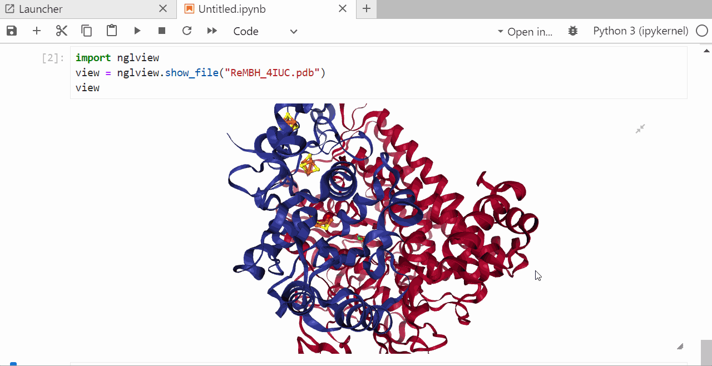

# How to Use This Plugin

This plugin can be used in a NOMAD Oasis installation. Check the tips in [Install this plugin](install_this_plugin.md) for details.

Once the NOMAD Oasis is deployed, you can generate different entries as shown below.

## Outline
1. [Create an upload and manage users](#1-create-an-upload-and-manage-users)
2. [Create a new sample entry](#2-create-a-new-sample-entry)
3. [Create a sample processing conditions entry](#3-create-sample-processing-conditions)
4. [Add an instrument entry](#4-add-an-instrument-entry)
5. [Add a measurement entry](#5-add-a-measurement-entry)
6. [Upload a DFT calculation](#6-upload-a-dft-calculation)
7. [Create an ExperimentELN entry](#7-create-an-experimenteln-entry)
8. [Use the dedicated UniSysCat Explore App](#8-use-the-dedicated-unisyscat-explore-app-to-get-an-overview-and-find-entries)
9. [Run a jupyter notebook to visualize the `.pdb` file](#9-run-a-jupyter-notebook-to-visualize-the-pdb-file)


## 1. Create an upload and manage users

<iframe src="https://scribehow.com/embed/Add_Users_to_a_Nomad_Oasis_Upload__hGhkAMCATXWdHGjeleDB0A" width="100%" height="640" allowfullscreen frameborder="0"></iframe>

## 2. Create a new sample entry
<iframe src="https://scribehow.com/embed/Upload_custom_data_entry_with_specific_schema_in_NOMAD_Oasis__mRg47mlZSpOSQ5G_HFlq7A" width="100%" height="640" allowfullscreen frameborder="0"></iframe>

## 3. Create sample processing conditions
<iframe src="https://scribehow.com/embed/Create_Material_Processing_ELN_Entry_in_NOMAD_Oasis___8kJxxjiRueC6AIMpgGaAw" width="100%" height="640" allowfullscreen frameborder="0"></iframe>

## 4. Add an instrument entry
<iframe src="https://scribehow.com/embed/Create_a_Custom_Instrument_Schema_in_Nomad_Oasis__-RkLffMjT22hj9BAipE1KQ" width="100%" height="640" allowfullscreen frameborder="0"></iframe>

## 5. Add a measurement entry

<iframe src="https://scribehow.com/embed/Create_a_Measurement_Upload_in_NOMAD_Oasis__xqwktvKPQUSPK8aT0E-58A" width="100%" height="640" allowfullscreen frameborder="0"></iframe>

## 6. Upload a DFT calculation

<iframe src="https://scribehow.com/embed/Upload_DFT_Files_Using_Nomad_Oasis_Interface__qdOffE1DSnSuvKsjP8dwZw" width="100%" height="640" allowfullscreen frameborder="0"></iframe>

## 7. Create an ExperimentELN entry

You can create an Experiment entry and link all related activities in one entry, similar to the sample processing entry. Select ExperimentELN Entry from the drop-down menu and link the references in the subsection "steps"

## 8. Use the dedicated UniSysCat Explore App to get an overview and find entries

<iframe src="https://scribehow.com/embed/Entry_Overview_and_Search_in_the_UniSysCatApp__NjapCJVCRpWOwL_diCv5eQ" width="100%" height="640" allowfullscreen frameborder="0"></iframe>

## 9. Run a jupyter notebook to visualize the `.pdb` file

<iframe src="https://scribehow.com/embed/Visualizing_pdb_files_through_NOMAD_Remote_Tools_Hub__IdryIk1lRpaDI8TQm6ajbg" width="100%" height="640" allowfullscreen frameborder="0"></iframe>

In the open jupyter notebook install the ngl package by typing
`pip install nglview` <kbd>shift</kbd> +<kbd>enter</kbd>

```
import nglview
view = nglview.show_file("ReMBH_4IUC.pdb")
view
```
After executing the cell you will see an interactive image of the protein.

